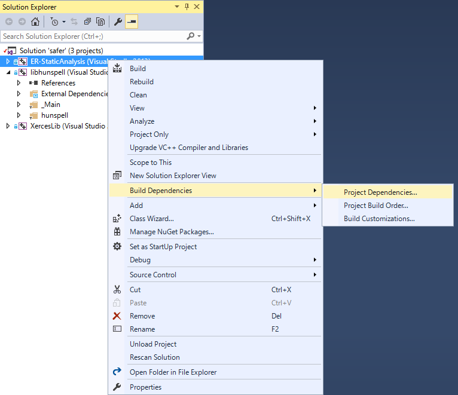
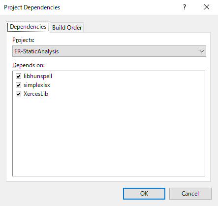
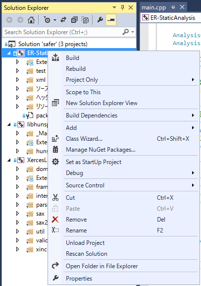
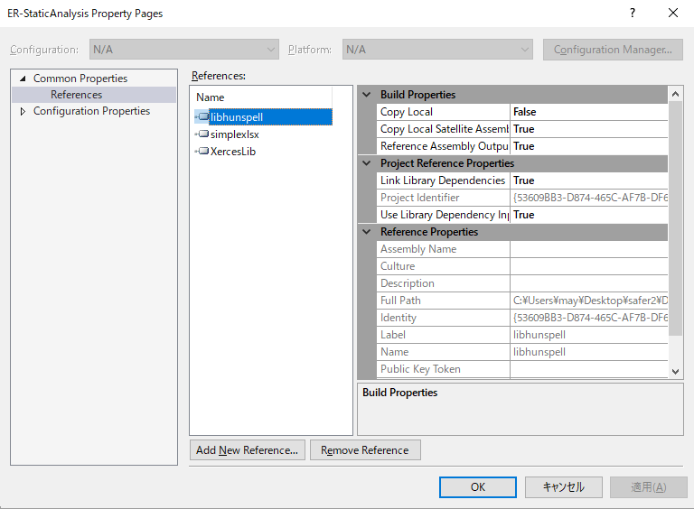
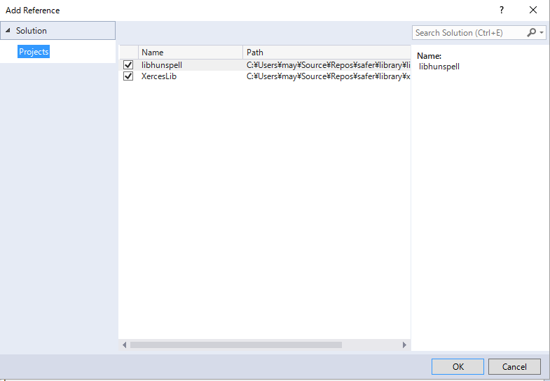
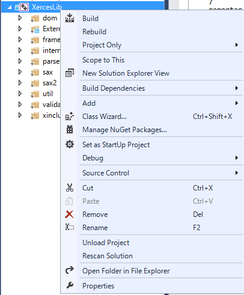
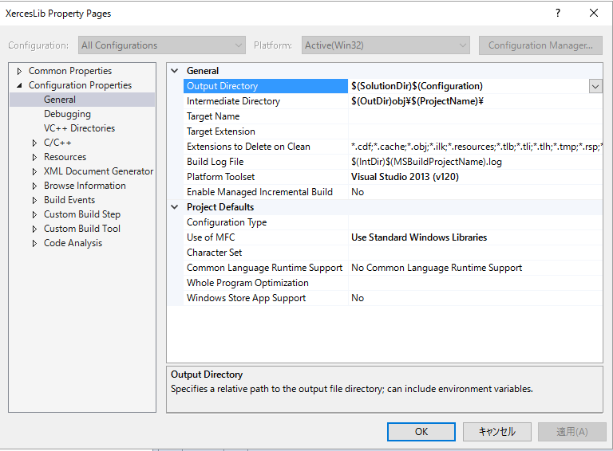

# safer

Overview

* Static Analysis engine for ER

## Description

* This application is static analysis for ER file.(このアプリケーションはERファイルを静的解析するアプリケーションです)
* It detects careless mistake from the input ER file.(入力されたER図ファイルから、ケアレスミスを検知します)

## Compatible

* OS
 * Windows 7 or later (Tested by 7 Professional and 10 Professional) 
 
* ER design file's format
 * A5:SQL Mk-2
 * ER Master

## Demo


## Requirement

* Xerces-C++
* libhunspell
* boost Version 1.58.0.0
* boost_program_options
* boost_regex
* boost_filesystem
* boost_system

## Synopsis

```
safer.exe [option]
Allowed options:
  -h [ --help ]                                   command help(コマンド説明)
  -e [ --erfile ] <ER file>                       ER図ファイルを指定してください(対応フォーマットA5Mk2 & ER Master)
  -c [ --cofile ] <safer.exe's config file>       ER図解析設定ファイルを指定してください
  -o [ --outputDir ] <output dir for report file> レポートファイルの出力先を指定してください
```

## Usage

```
# Change dir
$ cd <exe dir>

# Run example command 
safer.exe --erfile=./sample/bad-test.a5er --cofile=./sample/test-command.xml --outputDir=./

# Open by Excel the safer.exe output xlsx file.
```

## Tutorial for build (for Windows)

1. Get source code
  1. Example command : ` git.exe clone --recursive https://github.com/asugeno/safer.git . `
1. Open the "safer/safer.sln" by "Visual Studio 2013" (e.g. "Visual Studio Express 2013 for Windows Desktop")
1. Please step on following procedure below in Visual Studio.
  1. Add libhunspell and XercesLib project to solution of Visual Studio.
    1. In Solution Explorer, right-click the "safer" solution, click Add, and then click Existing Project.
    1. In the Add Existing Project dialog box, select Hunspell and Xerces-C++ project then click OK.
  1. Change the project Dependencies.
    1. In Solution Explorer, right-click the ER-StaticAnalysis solution , click Build Dependencies, and then click Project Dependencies.
    
    1. In Project Dependencies window. To check a box libhunspell and XercesLib in "Depends on".
    
  1. Add reference in ER-StaticAnalysis project.
    1. In Solution Explorer, right-click the "ER-StaticAnalysis project". And Click "Properties". 
    
    1. In ER-StaticAnalysis Property Pages window, Click the "Reference" under "Common Properties".
    
    1. And click "Add New Reference".
    1. In "Add Reference" window, To check a box libhunspell and XercesLib. And click "OK".
    
    1. In ER-StaticAnalysis Property Pages window, Switch to "true" at "Copy Local Satellite Assemblies", "Reference Assembly Output", "Link Library Dependencies", "User Library Dependency Inputs"
      1. Perform the same step as described above to "libhunspell".
    
1. Rename file
  1. Change the file name "hunvisapi.h.in" to "hunvisapi.h" in libhunspell dir
1. Change output dir on "XercesLib" project.
  1. In Solution Explorer, right-click the "XercesLib project". And Click "Properties". 
  
  1. In "XercesLib Properties" window, Click "General" under the "Configuration Properties". And change the "Output Directory" value to "$(SolutionDir)$(Configuration)".
  


## Licence

[MIT](https://opensource.org/licenses/mit-license.php)

## Author

[Akihiro Sugeno](https://github.com/asugeno)


