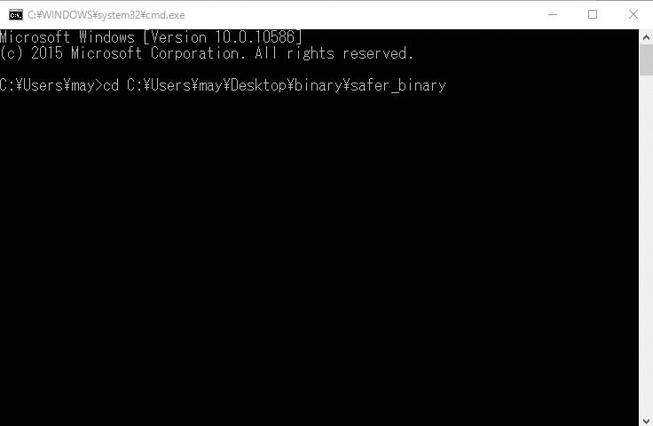

# safer 
[](https://ci.appveyor.com/project/AkihiroSugeno/safer/branch/master) [](https://travis-ci.org/asugeno-projects/safer)[](https://circleci.com/gh/asugeno-projects/safer/tree/master)

## Overview

* Static Analysis engine for ER

## Description

* This application is static analysis for ER file.(このアプリケーションはERファイルを静的解析するアプリケーションです)
* It detects careless mistake from the input ER file.(入力されたER図ファイルから、ケアレスミスを検知します)

## Compatible

* OS
  * Windows 7 or later (Tested by 7 Professional and 10 Professional) 
 
* ER design file's format
  * A5:SQL Mk-2
  * ER Master

## Demo



## Requirement

* Xerces-C++
* libhunspell
* boost Version 1.58.0.0
* boost_program_options
* boost_regex
* boost_filesystem
* boost_system
* boost_date_time

## Synopsis

```
safer.exe [option]
Allowed options:
  -h [ --help ]                                   command help(コマンド説明)
  -e [ --erfile ] <ER file>                       ER図ファイルを指定してください(対応フォーマットA5Mk2 & ER Master)
  -c [ --cofile ] <safer.exe's config file>       ER図解析設定ファイルを指定してください
  -o [ --outputDir ] <output dir for report file> レポートファイルの出力先を指定してください
```

## Usage

```
# Change dir
$ cd <exe dir>

# Run example command 
safer.exe --erfile=./sample/bad-test.a5er --cofile=./sample/test-command.xml --outputDir=./

# Open by Excel the safer.exe output xlsx file.
```

## Tutorial for build (for Windows)

* for Windows
  * [Windows build instructions](./Doc/build/windows.md)
* for Mac OSX
  * [Mac Build Instructions](./Doc/build/macos.md)
* for Ubuntu
  * [Ubuntu Build Instructions](./Doc/build/ubuntu.md)

## Build Status

| Windows(master) | Windows(dev) | Mac(master) | Mac(dev) | Ubuntu(master) | Ubuntu(dev) |
|:------------:|:------------:|:------------:|:------------:|:------------:|:------------:|
|[](https://ci.appveyor.com/project/AkihiroSugeno/safer/branch/master)|[](https://ci.appveyor.com/project/AkihiroSugeno/safer/branch/dev)|[](https://travis-ci.org/asugeno-projects/safer)|[](https://travis-ci.org/asugeno-projects/safer)|[](https://circleci.com/gh/asugeno-projects/safer/tree/master)|[](https://circleci.com/gh/asugeno-projects/safer/tree/dev)|

## Licence

[MIT](https://opensource.org/licenses/mit-license.php)

## Author

[Akihiro Sugeno](https://github.com/asugeno)


